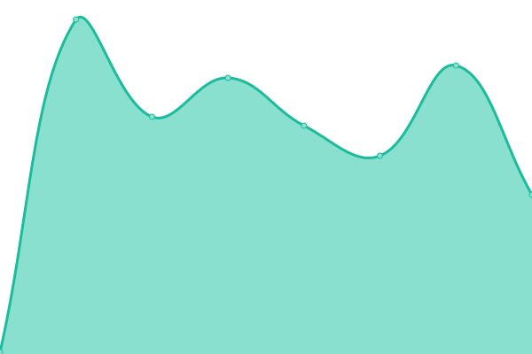
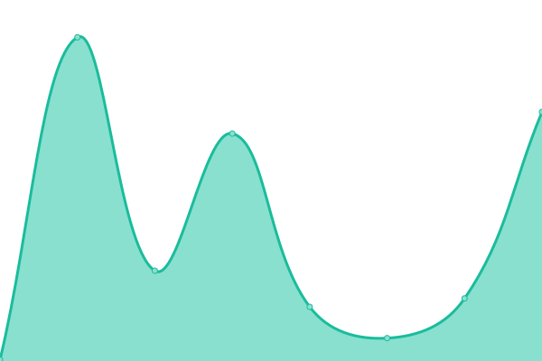

# [📈 Live Status](https://demo.upptime.js.org): <!--live status--> **🟧 Partial outage**

This repository contains the open-source uptime monitor and status page for [bungey](https://demo.upptime.js.org), powered by [Upptime](https://github.com/upptime/upptime).

With [Upptime](https://upptime.js.org), you can get your own unlimited and free uptime monitor and status page, powered entirely by a GitHub repository. We use [Issues](https://github.com/victorbungey/status_page/issues) as incident reports, [Actions](https://github.com/victorbungey/status_page/actions) as uptime monitors, and [Pages](https://demo.upptime.js.org) for the status page.

<!--start: status pages-->
<!-- This summary is generated by Upptime (https://github.com/upptime/upptime) -->
<!-- Do not edit this manually, your changes will be overwritten -->
<!-- prettier-ignore -->
| URL | Status | History | Response Time | Uptime |
| --- | ------ | ------- | ------------- | ------ |
|  [4G Capital](https://www.4g-capital.com) | 🟩 Up | [4-g-capital.yml](https://github.com/victorbungey/status_page/commits/HEAD/history/4-g-capital.yml) | 

 160ms
     
 | 

<a href="https://victorbungey.github.io/status_page/history/4-g-capital">100.00%</a>
    

|  [Mambu](https://merlin.mambu.com) | 🟩 Up | [mambu.yml](https://github.com/victorbungey/status_page/commits/HEAD/history/mambu.yml) | 

 600ms
     
 | 

<a href="https://victorbungey.github.io/status_page/history/mambu">100.00%</a>
    

|  [Merlin1](https://upia-ke.4g-capital.io) | 🟩 Up | [merlin1.yml](https://github.com/victorbungey/status_page/commits/HEAD/history/merlin1.yml) | 

 591ms
     
 | 

<a href="https://victorbungey.github.io/status_page/history/merlin1">100.00%</a>
    

|  [Twitter](https://twitter.com) | 🟩 Up | [twitter.yml](https://github.com/victorbungey/status_page/commits/HEAD/history/twitter.yml) | 

 209ms
     
 | 

<a href="https://victorbungey.github.io/status_page/history/twitter">100.00%</a>
    

|  [Test Site](victorbungey.github.io) | 🟥 Down | [test-site.yml](https://github.com/victorbungey/status_page/commits/HEAD/history/test-site.yml) | 

 103ms
     
 | 

<a href="https://victorbungey.github.io/status_page/history/test-site">0.00%</a>
    

<!--end: status pages-->

[**Visit our status website →**](https://demo.upptime.js.org)

## 📄 License

- Powered by: [Upptime](https://github.com/upptime/upptime)
- Code: [MIT](./LICENSE) © [bungey](https://demo.upptime.js.org)
- Data in the `./history` directory: [Open Database License](https://opendatacommons.org/licenses/odbl/1-0/)
